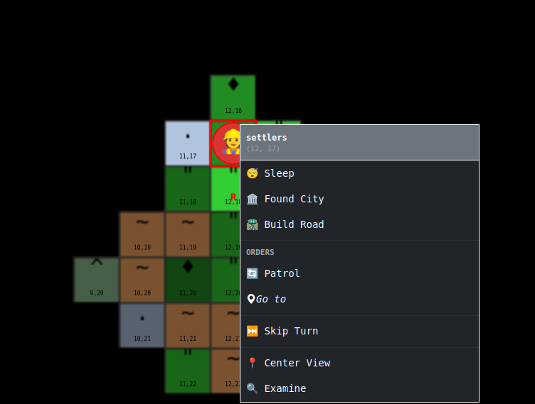
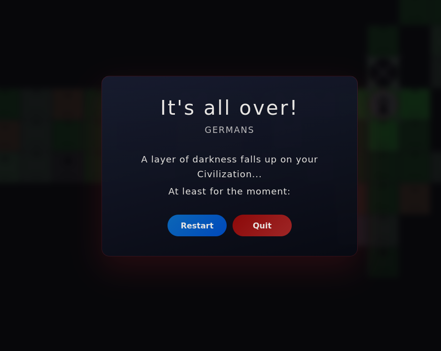
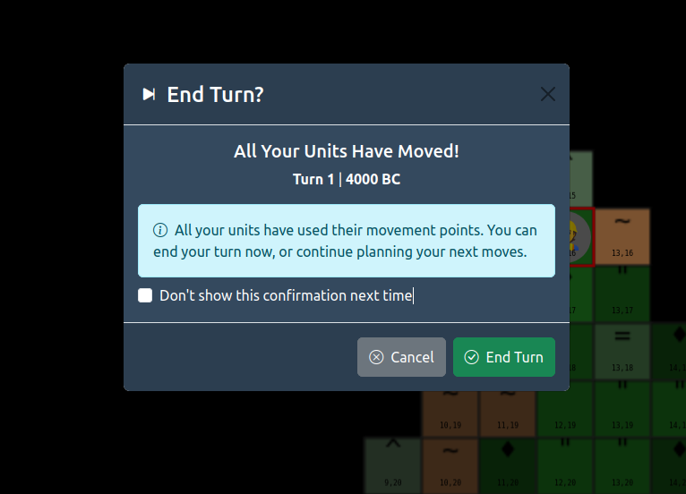

:toc:
:sectnums:

= Civilization I Browser Game


A modern, faithful browser-based recreation of Sid Meier's Civilization I (1991), built with React, Vite, Zustand, and Bootstrap. Experience the classic turn-based strategy game where you build an empire from 4000 BC to 2100 AD through exploration, diplomacy, warfare, and technological advancement.

[.text-center]
--
image::doc/2025-11-16_21-36.png[Screenshot 1, width=800]
image::doc/2025-11-16_21-36_1.png[Screenshot 2, width=800]

image::doc/1.png[Screenshot 3, width=800]
image::doc/2.png[Screenshot 4, width=800]

image::doc/3.png[Screenshot 5, width=800]




--


== Architecture

=== Project Structure

The project follows a modular architecture separating concerns:

```
src/
├── components/          # React UI components
│   ├── game/           # Game-specific components (canvas, units)
│   └── ui/             # User interface components (panels, modals)
├── data/               # Game data and constants
├── game/               # Core game logic
│   ├── engine/         # Game engine and managers
│   └── rendering/      # Canvas rendering systems
├── hooks/              # Custom React hooks
├── stores/             # Zustand state management
├── styles/             # CSS stylesheets
├── types/              # TypeScript type definitions
└── utils/              # Utility functions
```

== Implementation Status

=== Completed Features

* ✅ 14 playable civilizations with historical leaders
* ✅ City founding and basic management
* ✅ Unit movement and combat system
* ✅ Technology research tree
* ✅ Minimap with world overview
* ✅ Context menus for unit orders
* ✅ Terrain examination modal
* ✅ Adjustable UI settings
* ✅ Unit icon system (PNG/SVG/emoji with transparency)
* ✅ Auto production visual feedback
* ✅ Complete city production system

=== In Development

* 🔄 Building construction mechanics
* 🔄 Wonder construction
* 🔄 AI civilization behavior
* 🔄 Diplomacy system
* 🔄 Government changes and effects

=== Planned Features

* 📋 Save/load game system
* 📋 Full tech tree completion
* 📋 Animated unit combat
* 📋 Sound effects and music
* 📋 Multiplayer support (hot-seat)
* 📋 Advanced AI strategies
* 📋 Random events system
* 📋 Barbarian uprising mechanics

=== Core Systems

**Game Engine** (`GameEngine.ts`)::
Central game logic coordinator managing turns, civilizations, and game state.

**Turn Manager** (`TurnManager.ts`)::
Handles turn progression, phase management, and end-turn logic.

**Map System** (`HexGrid.ts`, `Map.ts`)::
Hexagonal grid implementation with terrain generation and pathfinding.

**Unit System** (`Unit.ts`, `UnitActionManager.ts`)::
Unit creation, movement, combat, and AI behavior.

**City System** (`City.ts`, `ProductionManager.ts`)::
City management, growth, production, and resource calculation.

**Technology System** (`TechnologyManager.ts`)::
Research progression and technology unlocks.

**AI System** (`AIUtility.ts`, `SettlementEvaluator.ts`)::
Computer opponent decision-making and strategy.

**Rendering System** (`MapRenderer.ts`)::
Canvas-based map and unit rendering with performance optimizations.

=== State Management

**Zustand Store** (`GameStore.ts`)::
Centralized state management with:
* Game state (current turn, civilizations, map)
* UI state (selected units, modals, camera position)
* Settings and preferences
* Actions for state mutations

**React Integration**::
* Custom hooks (`useGameEngine`) connect React to game engine
* Component-level state for UI interactions
* Event-driven updates between game logic and UI

=== Data Architecture

**Constants and Data**::
* `GameConstants.ts` - Game rules and balance values
* `UnitConstants.ts` - Unit properties and statistics
* `BuildingConstants.ts` - Building costs and effects
* `TechnologyData.ts` - Technology tree structure
* `TerrainData.ts` - Terrain properties and bonuses

**Type Definitions** (`types/game.ts`)::
Comprehensive TypeScript interfaces for type safety across the application.

== Tech Stack

=== Frontend Framework
* **React 18**: Modern React with hooks, functional components, and concurrent features
* **TypeScript**: Full type safety and enhanced developer experience
* **Vite**: Lightning-fast development server and optimized production builds

=== State Management
* **Zustand**: Lightweight, scalable state management with atomic updates
* **React Context**: Component-level state and prop threading

=== UI Framework
* **Bootstrap 5**: Responsive design system and component library
* **React Bootstrap**: React integration for Bootstrap components
* **Bootstrap Icons**: Consistent iconography throughout the interface

=== Rendering and Graphics
* **HTML5 Canvas**: Hardware-accelerated 2D graphics rendering
* **Canvas API**: Custom drawing routines for maps, units, and UI elements

=== Development Tools
* **ESLint**: Code linting and style enforcement
* **Vitest**: Unit testing framework
* **TypeScript Compiler**: Type checking and compilation
* **Prettier**: Code formatting (via ESLint integration)

=== Build and Deployment
* **Vite**: Fast bundling and development server
* **npm**: Package management and script execution
* **Git**: Version control and collaboration

== Game Overview

Civilization I is a turn-based strategy game where players guide a civilization from the ancient era to the space age. Compete against AI-controlled civilizations led by historical figures, manage cities, research technologies, and achieve victory through conquest, space colonization, or cultural dominance.

=== Historical Civilizations

Choose from 14 authentic civilizations, each with unique leaders and city names:

* **Americans** (Abraham Lincoln) - Blue from the stars and stripes
* **Aztecs** (Montezuma) - Jungle-inspired teal
* **Babylonians** (Hammurabi) - Pottery brown/orange
* **Chinese** (Mao Tse Tung) - Imperial yellow
* **Egyptians** (Ramesses II) - Nile valley gold
* **English** (Elizabeth I) - Royal red
* **French** (Napoleon Bonaparte) - White for defete
* **Germans** (Frederick the Great) - Gray from the iron cross
* **Greeks** (Alexander the Great) - Mediterranean blue
* **Indians** (Mahatma Gandhi) - Saffron and green
* **Kazakhs** (Genghis Khan) - Kazakh turquoise
* **Romans** (Julius Caesar) - Black since all other colors were taken
* **Russians** (Joseph Stalin) - Soviet red
* **Zulus** (Shaka) - African tribal colors

=== Victory Conditions

**Conquest Victory**::
Eliminate all rival civilizations by capturing or destroying their cities.

**Space Race Victory**::
Build the Apollo Program wonder, construct spaceship components, and launch to Alpha Centauri before competitors.

**Score Victory**::
Achieve the highest civilization score by 2100 AD, calculated from population, territory, cities, technologies, wonders, and achievements.

== Core Game Concepts

=== Game Structure

**Rounds and Turns**::
* *Round*: Completed when all active civilizations finish their turns. Year advances at round end.
* *Turn*: Each civilization's opportunity for actions. Phases: START → UNIT_MOVEMENT → CITY_PRODUCTION → RESEARCH → END.
* *Moves*: Units have movement points per turn, cannot exceed limits.

**Time Progression**::
Game spans 4000 BC to 2100 AD with era-dependent year increments:

[cols="1,1", options="header"]
|===
|Era |Years per Round

|Before 1000 AD
|+20 years

|1000–1499 AD
|+10 years

|1500–1749 AD
|+5 years

|1750–1849 AD
|+2 years

|1850+ AD
|+1 year
|===

NOTE: Year 0 is skipped (1 BC → 1 AD).

=== Resource Management

**Food**::
Enables city growth and population increase. Surplus accumulates for expansion.

**Production (Shields)**::
Builds units, buildings, and wonders. Cities produce one item at a time.

**Trade (Commerce)**::
Generates gold for purchasing units and buildings. Enhanced by marketplaces and banks.

**Science**::
Advances technology research. Boosted by libraries and universities.

**Gold**::
Maintains units, purchases improvements. Generated from trade and taxation.

=== City Management

**Founding Cities**::
* Use Settler units on suitable terrain
* Placement affects resource access and defense
* Cities cannot be adjacent

**City Growth**::
* Accumulate food surplus for population increase
* Size affects production and science output
* Aqueduct required for growth beyond size 10

**Production System**::
* Cities build units, buildings, or wonders
* Production rate depends on terrain, population, improvements
* Granary halves growth food requirements

**Happiness Management**::
* Citizens: Happy, Content, or Unhappy
* Unhappy citizens cause disorder (no production)
* Temples, Colosseums, Wonders improve happiness
* Martial law (military units) suppresses unrest

=== Technology Research

**Research System**::
* Choose technology per turn
* Speed depends on total science output
* Technologies unlock units, buildings, wonders

**Technology Eras**:
1. **Ancient**: Pottery, Bronze Working, The Wheel, Alphabet, Writing
2. **Classical**: Iron Working, Mathematics, Currency, Republic, Monarchy
3. **Medieval**: Feudalism, Chivalry, Theology
4. **Renaissance**: Democracy, Invention, Navigation
5. **Industrial**: Railroad, Steam Engine, Industrialization
6. **Modern**: Rocketry, Computers, Space Flight, Nuclear Fission

=== Military System

**Unit Types**:
* **Settler** (0/1/1) - Founds cities, builds improvements
* **Warrior** (1/1/1) - Basic military unit
* **Phalanx** (1/2/1) - Defensive infantry (Bronze Working)
* **Legion** (4/2/1) - Roman heavy infantry (Iron Working)
* **Horsemen** (2/1/2) - Fast cavalry (Horseback Riding)
* **Chariot** (3/1/2) - Ancient mobile unit (The Wheel)
* **Catapult** (6/1/1) - Siege weapon (Mathematics)
* **Trireme** (1/1/3) - Naval transport (Map Making)
* **Pikemen** (1/2/1) - Medieval defensive unit (Feudalism)
* **Musketeer** (2/3/1) - Gunpowder unit (Gunpowder)

**Combat Mechanics**:
* Strength = Base × Terrain Bonus × Fortification × Veteran Status
* Hills: +100% defense, Mountains: +200% defense
* Fortified units: +50% defense
* Veteran units: +50% effectiveness (from battles)
* Barracks make new units Veterans

=== Terrain and Improvements

**Terrain Types**:
* **Grassland** - 2 food, 0 production, 0 trade
* **Plains** - 1 food, 1 production, 0 trade
* **Desert** - 0 food, 1 production, 0 trade
* **Tundra** - 1 food, 0 production, 0 trade
* **Forest** - 1 food, 2 production, 0 trade (+50% defense)
* **Hills** - 1 food, 2 production, 0 trade (+100% defense)
* **Mountains** - 0 food, 1 production, 0 trade (+200% defense)
* **Ocean** - 1 food, 0 production, 2 trade

**Terrain Improvements**:
* **Road** - Movement cost 1/3, +1 trade on trade-producing terrain
* **Railroad** - Zero movement cost, +50% production
* **Irrigation** - +1 food on grassland/plains/desert
* **Mine** - +1 production on hills/mountains
* **Fortress** - +100% defense, heals units

=== Government Types

**Despotism** (Starting)::
High corruption, free unit support, no bonuses.

**Monarchy** (Monarchy tech)::
Medium corruption, low unit costs, effective martial law.

**Republic** (Republic tech)::
Low corruption, medium costs, +1 trade per square, senate oversight.

**Democracy** (Democracy tech)::
Minimal corruption, high costs, +1 trade per square, maximum happiness, strict senate control.

**Communism** (Communism tech)::
Low corruption, medium costs, no senate interference, effective espionage.

=== Diplomacy

**Diplomatic Actions**:
* Declare War
* Negotiate Peace
* Sign Alliance
* Trade Technologies
* Establish Embassy
* Demand Tribute
* Exchange Maps

**Diplomatic States**:
* **Peace** - No hostilities
* **War** - Active conflict
* **Alliance** - Military cooperation
* **Cease Fire** - Temporary peace

=== Wonders of the World

**Ancient Wonders**:
* **Pyramids** (200) - Granary effect in every city
* **Hanging Gardens** (200) - +1 happy citizen per city
* **Colossus** (200) - +1 trade per square
* **Lighthouse** (200) - Safe Trireme sea travel
* **Oracle** (300) - Temple in every city
* **Great Wall** (300) - Double defense vs barbarians

**Classical/Medieval Wonders**:
* **Great Library** (300) - Free techs for 2 civilizations
* **Copernicus' Observatory** (300) - +50% science in city

**Modern Wonders**:
* **Isaac Newton's College** (400) - Doubles science in city
* **Apollo Program** (600) - Enables spaceship construction

=== Barbarians

**Barbarian Mechanics**:
* Spawn randomly in unexplored areas
* Frequency increases with difficulty
* Attack nearby cities and units
* Gold rewards for victories
* Great Wall doubles defense against them

== Features

=== Core Gameplay Features

* **Turn-based Strategy**: Classic Civilization mechanics with modern React architecture
* **Hexagonal Grid System**: Accurate hex-based world map with smooth navigation and terrain rendering
* **AI Civilizations**: Compete against computer opponents with distinct personalities and strategies
* **City Management**: Comprehensive city building, population management, and resource allocation
* **Unit System**: Diverse military units with movement, combat, and special abilities
* **Technology Research**: Extensive tech tree with prerequisites and unlocks
* **Resource Management**: Balance food, production, trade, science, and gold across your empire
* **Government Systems**: Five government types with different bonuses and penalties
* **Diplomacy System**: Negotiate with other civilizations through various diplomatic actions
* **Wonder Construction**: Build world wonders for powerful bonuses and historical achievements

=== User Interface Features

* **Responsive Design**: Bootstrap-powered interface optimized for desktop and mobile
* **Interactive Map**: Canvas-based rendering with zoom, pan, and terrain examination
* **Minimap**: World overview with navigation and territory display
* **Context Menus**: Right-click menus for unit orders and terrain improvements
* **Modal Dialogs**: Detailed views for cities, units, technologies, and game settings
* **Settings Panel**: Adjustable UI preferences and game options
* **End Turn Confirmation**: Prevent accidental turn endings
* **Game Result Overlay**: Victory/defeat announcements with statistics

=== Technical Features

* **Modern Unit Icons**: PNG priority with SVG and emoji fallbacks, transparent backgrounds showing terrain
* **Hardware-Accelerated Rendering**: HTML5 Canvas for smooth game performance
* **State Management**: Zustand for scalable, atomic state updates
* **Error Boundaries**: React error handling for robust user experience
* **Type Safety**: Full TypeScript implementation for maintainable code
* **Modular Architecture**: Clean separation of game logic, UI components, and data
* **Performance Optimization**: Efficient rendering and state updates for large game worlds

== Installation

=== Prerequisites

* Node.js 18 or higher
* npm or yarn package manager
* Modern web browser with HTML5 Canvas support

=== Setup Instructions

1. **Clone the repository**:
+
[source,bash]
----
git clone https://github.com/JCTRoth/Civ1Browser.git
cd Civ1Browser
----

2. **Install dependencies**:
+
[source,bash]
----
npm install
----

3. **Start development server**:
+
[source,bash]
----
npm run dev
----

4. **Open in browser**:
+
Navigate to `http://localhost:3000`

=== Production Build

[source,bash]
----
npm run build
npm run preview
----

== Usage

=== Game Setup

1. **Select Difficulty**: Choose from Chieftain to Emperor levels
2. **Choose Civilization**: Pick from 14 historical civilizations
3. **Configure Opponents**: Select number and types of AI civilizations
4. **Set World Size**: Choose map dimensions and terrain settings
5. **Start Game**: Begin your civilization's journey

=== Controls

==== Keyboard Shortcuts

* **Arrow Keys**: Scroll map view
* **Enter**: End current turn
* **B**: Build city (with selected Settler)
* **F**: Fortify selected unit
* **S**: Put unit to sleep/sentry
* **Space**: Skip current unit
* **W**: Wait (keep unit active for later)
* **I**: Irrigate terrain
* **M**: Mine terrain
* **R**: Build road
* **Ctrl+S**: Quick save
* **F1**: Technology tree
* **F2**: City list
* **F3**: World map

==== Mouse Controls

* **Left Click**: Select units, cities, or terrain
* **Right Click**: Open context menu for actions
* **Scroll Wheel**: Zoom in/out
* **Click + Drag**: Pan map view

=== Basic Gameplay

1. **Explore**: Move units to reveal the map and find resources
2. **Settle**: Use Settlers to found cities on good terrain
3. **Research**: Choose technologies to unlock new capabilities
4. **Build**: Construct buildings and units in your cities
5. **Expand**: Grow your territory and influence
6. **Conquer**: Engage in warfare when necessary
7. **Diplomacy**: Negotiate with other civilizations
8. **Victory**: Achieve one of the victory conditions

== Development

=== Available Scripts

* `npm run dev` - Start development server
* `npm run build` - Create production build
* `npm run preview` - Preview production build
* `npm run lint` - Run ESLint
* `npm run type-check` - Run TypeScript compiler check
* `npm run test` - Run unit tests

=== Development Guidelines

**Code Style**:
* Use TypeScript for all new code
* Follow React functional component patterns
* Use custom hooks for complex logic
* Maintain separation between UI and game logic

**Component Structure**:
* Keep components focused on single responsibilities
* Use presentational/container component pattern
* Leverage Bootstrap for consistent styling

**State Management**:
* Use Zustand for global game state
* Component state for local UI concerns
* Avoid prop drilling with appropriate state scoping

**Performance**:
* Optimize Canvas rendering with dirty rectangles
* Use React.memo for expensive components
* Implement proper key props for list rendering

=== Architecture Decisions

**Hexagonal Grid**::
Chosen over square grid for more accurate terrain representation and movement realism.

**Canvas Rendering**::
Selected over DOM-based rendering for better performance with large maps and many units.

**Zustand over Redux**::
Lighter weight, less boilerplate, better TypeScript integration for this project scope.

**Bootstrap Integration**::
Provides consistent, responsive UI without custom CSS framework development.

=== Testing Strategy

* **Unit Tests**: Core game logic functions
* **Integration Tests**: Component interactions
* **E2E Tests**: Full game flows (planned)

=== Contributing

1. Fork the repository
2. Create a feature branch
3. Make changes with tests
4. Ensure linting passes
5. Submit pull request

== Scoring System

Civilization score calculated from:

* **Population**: 1 point per citizen
* **Land Area**: 1 point per controlled tile
* **Cities**: 5 points per city
* **Technologies**: 5 points per researched technology
* **Wonders**: 20 points per constructed wonder
* **Future Tech**: 5 points each (post-2100 AD)
* **Peace Years**: Bonus for peaceful periods
* **Pollution**: Penalty for environmental damage

== Strategy Guide

=== Early Game (4000-1000 BC)

1. Build 2-3 Settlers immediately to claim prime locations
2. Research Pottery → Bronze Working → Alphabet
3. Found cities near rivers and resources
4. Build Warriors/Phalanx for defense and exploration
5. Establish contact with other civilizations

=== Mid Game (1000 BC - 1000 AD)

1. Build Libraries in all cities for science boost
2. Research Currency → Republic for economic power
3. Construct Wonders like Great Library, Oracle
4. Expand military for territorial control
5. Switch to Republic government

=== Late Game (1000-2100 AD)

1. Focus on Democracy for maximum productivity
2. Build Factories and Research Labs
3. Research toward Space Flight for space race
4. Build Apollo Program + spaceship parts
5. Or conquer remaining civilizations

=== City Placement Strategy

* **Rivers**: +1 trade on river squares
* **Coast**: Ocean trade access and naval units
* **Resources**: Bonus food/production/trade
* **Defense**: Hills and forests provide bonuses
* **Spacing**: Leave room for city radius growth

=== Technology Priorities

**Science Victory**: Alphabet → Writing → Code of Laws → Literacy → Republic → Democracy → Rocketry → Space Flight

**Military Victory**: Bronze Working → Iron Working → Mathematics → Gunpowder → Metallurgy → Conscription

**Economic Victory**: Pottery → The Wheel → Currency → Trade → Banking → Economics

== Historical Accuracy

This browser clone faithfully recreates the original Civilization I experience while modernizing the interface for contemporary browsers and significantly speeding up the game. Game balance, technology costs, unit statistics, and core mechanics mirror mostly the 1991 original.

== Credits

**Original Game**: Sid Meier's Civilization (MicroProse, 1991) +
**Design**: Sid Meier & Bruce Shelley +
**Browser Implementation**: Educational recreation project +
**Built With**: React, Vite, Zustand, Bootstrap, HTML5 Canvas

---

**Glory to your civilization! May you build an empire to stand the test of time!** 🏛️
