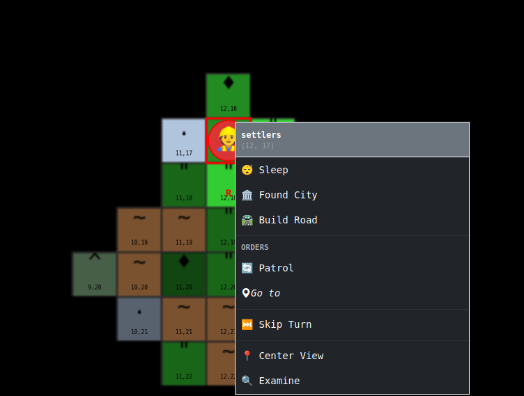
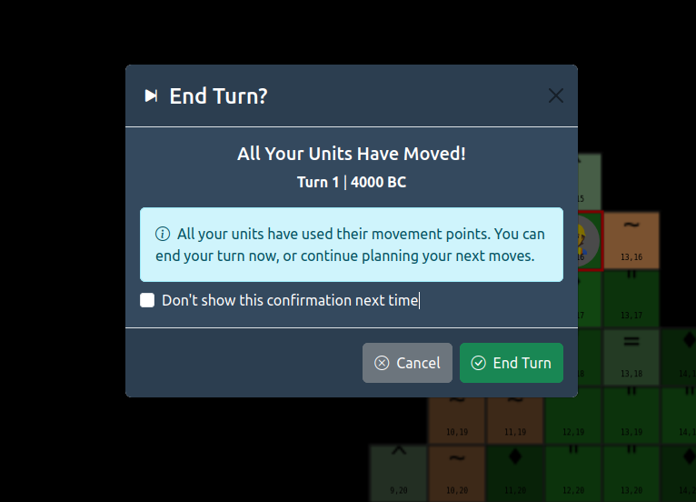
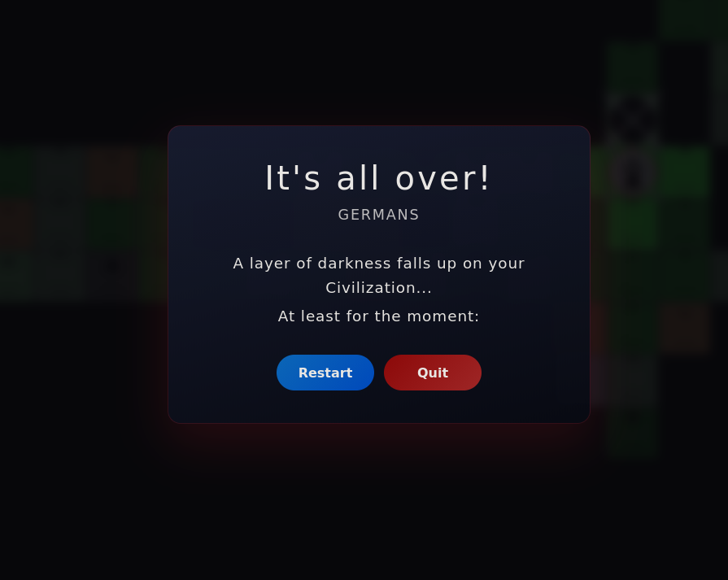

:toc:
:toclevels: 2
:sectnums:

= Civilization I Browser Game

**Overall Assessment** +
Zivilisation_1 is not a perfect clone, but it is not trying to be one. +
It is a spiritual successor that takes the core concepts of Civilisation and reimagines them for a modern audience. +
For players seeking a nostalgic Civilization-like experience in the browser, it delivers! +
For purists seeking a 1:1 recreation of the 1991 original, it falls short in several areas but therefor it introduces more stratgic depth, more strategie and a non-cheating AI. +
The implementation is technically impressive (TypeScript, React, Vite, comprehensive tests, data-driven design) and functionally complete (the game is winnable and playable). +
The developers should be commended for creating a sophisticated strategy game that honors its inspiration while making sensible modernizations. +

It is not a rules-accurate port. Where this codebase and the 1991 original
disagree, the codebase wins: some mechanics the original had (
housing caps, score victory) are absent, and the technology and wonder trees
diverge. What it has instead is a full simulation — economy, combat, diplomacy,
fog of war, naval logistics and a 15k-line AI layer — that runs headlessly and
is covered by 1,500+ tests.

[cols="1,1"]
|===
|Code |~70,000 lines TypeScript/TSX across ~150 files
|Engine |`GameEngine.ts` (~7,200 lines) + 51 engine files, ~34,800 lines
|AI |17 files, ~14,500 lines (`AIManager.ts` alone is ~7,500)
|Rendering |6 files, ~4,700 lines (two-layer canvas)
|Tests |153 Vitest suites, 1,537 cases, node environment (no DOM)
|Browser tests |4 Playwright specs + setup
|Balance data |13 tables in `src/data/` — every number in one place
|===

[.text-center]
--
image::doc/1.jpg[Screenshot, width=700]
image::doc/world_map.png[World map, width=700]



--

== Status

=== Implemented

Gameplay::
* 14 civilizations with leaders, portraits and city-name lists
* City founding, joining, capture, destruction, razing, governors, specialists
* Growth, starvation, granaries, disorder, martial law
* 33 units across land, sea, air and civilian, with stacking, GoTo, sleep/fortify/skip/wait
* 54 technologies (8 available at the start) with map-size and difficulty cost scaling
* Six governments plus Anarchy, revolutions, capital relocation
* Diplomacy: war, peace, ceasefires, alliances, five treaty types, bribes, tech exchange
* Trade routes, ferries with cargo, Fisher Boats and fishing nets
* Barbarians, goody huts, tile improvements, pollution
* Fog of war with per-player visibility and cross-turn scout memory
* Two victory conditions: Moonshot and elimination
* 24 world wonders with a data-driven effect model

Systems::
* Save/load — versioned JSON (v4) with v1–v4 migration
* Full AI: 6 production profiles, strategy selection, research, government,
  diplomacy, army groups, naval doctrine, city governor, auto-production
* Headless batch runners and a progression export (JSON + compact CSV)
* 13 map types, including 3 static maps and 4 unattended AI-vs-AI scenarios
* Animated movement, combat, camera glides, death
* Minimap, tech tree, statistics, demographics, settings, game menu
* URL parameters for reproducible, unattended runs

=== Commands, not calls

The UI never calls the engine directly. Every player intent is a `Command`
(`types/commands.ts`) sent through a `GameSession` (`src/utils/session.ts`) to
`GameEngine.submit(command, context)`, which validates **whose turn it is** and
**who owns the subject** before delegating to the rules engine. Rejections are
typed values (`NOT_YOUR_TURN`, `NOT_YOUR_UNIT`, …), never silent.

This is the seam that will carry the planned client/server split: a remote
session implements the same interface over a socket, and the UI does not change.

=== In development (design proposals only)

* Per-civ doctrines — link:doc/leader-doctrines.adoc[Leader Doctrines]
* AI governor rebuild — link:doc/space-bunny-free_ai_gov.adoc[AI Governor Architecture]

Neither is implemented. Choosing a civilization currently changes only your
colour, portrait and city-name list.

=== Known gaps

* **No score-based win.** The Civ I score is calculated every turn and shown,
  but only Moonshot and elimination end a game.
* **No housing cap.** An Aqueduct does not gate city size.
* **No sound.** There is no audio layer at all.
* **Siege and air units do not ignore city walls.** The `ignoresWalls` flag
  exists in `CombatSystem` but no caller sets it, so walls always apply.
* **A 4-turn research minimum is not enforced.** Only the 32-turn maximum is.
* **Auto-production is on by default** for new cities (toggle per city), so it
  is not strictly opt-in.

== Architecture

=== Layout

```
src/
├── components/          # React UI
│   ├── game/            # GameCanvas, unit stack / action modals
│   └── ui/              # TopBar, SidePanel, dialogs (gamemodals/)
├── data/                # Every balance number: terrains, units, buildings,
│   │                    # techs (54), governments, improvements, wonders (24)
│   └── maps/            # Static Freeciv-derived maps + registry
├── game/
│   ├── engine/          # GameEngine + turn/economy/combat/diplomacy/AI
│   │   ├── AI/          # ~14,500 lines over 17 files
│   │   ├── diplomacy/   # Opinion ledger, proposal scoring
│   │   └── MapGenerator/# Procedural world generation
│   └── rendering/       # Canvas layers, minimap, textures, animation
├── hooks/               # useGameEngine: engine ↔ React wiring
├── stores/              # GameStore.ts — one Zustand store
├── utils/               # session (command layer), event handlers, export, log
└── styles/              # 19 CSS files
types/                   # game.ts, progression.ts, commands.ts — shared types
tests/  e2e/  scripts/   # Vitest (node env), Playwright, headless runners
doc/                     # Subsystem documentation — index below
```

Four files near the root of `src/game/` (`City.ts`, `Unit.ts`, `Terrain.ts`,
`Civilization.ts`, ~2,500 lines) are legacy classes that nothing imports. The
runtime uses the interfaces in `types/game.ts` and the `src/data/` tables. Do
not add rules there.

=== Core systems

[cols="1,2"]
|===
|File |Responsibility

|`GameEngine.ts` (~7,200 lines)
|World state and the public API: grid, units, cities, civilizations, techs,
per-player storage, ID counter. Emits every change through one
`onStateChange(eventType, data)` channel. Also hosts `submit()` — the command
layer's entry point.

|`TurnManager.ts` (~1,600)
|The phased turn engine: `START → UNIT_MOVEMENT → CITY_PRODUCTION → RESEARCH →
END`, round boundary, unit reset, the economic pipeline and AI turns.

|`engine/AI/` (~14,500)
|The computer player. `AIManager.ts` (~7,500) is the turn orchestrator. See
link:doc/AI_OVERVIEW.adoc[AI Overview].

|`CombatSystem.ts`
|The single place a battle is resolved. See <<combat, combat>> below.

|`EconomicManager.ts` (~1,600)
|Yields, corruption, rates, food, growth, happiness, upkeep, bankruptcy.

|`ProductionManager.ts` / `AutoProduction.ts`
|Build queues, tech gating, and the auto-production governor the AI and the
player share.

|`DiplomacyManager.ts` + `engine/diplomacy/`
|Opinion ledger, proposals, treaties, war declaration rules.

|`MapGenerator/`
|Continents → temperature → climate → age → rivers → polar caps → resources.

|`rendering/` (~4,700)
|A cached static terrain layer, a dynamic unit/city layer, an offscreen minimap,
composable tile textures.

|`stores/GameStore.ts` (~1,200)
|One Zustand store: a *mirror* of engine state for React, plus all UI state.
|===

=== The read path and the write path

* **Write:** UI → `session.send(command)` → `GameEngine.submit()` → engine
  methods. `submit()` is the only place that decides who may act.
* **Read:** engine → `onStateChange` → `EngineEventHandlers.ts` → Zustand store
  → React. The store is a projection; the engine is the source of truth.

Zustand is the only state container in the project — there is no React Context.
There are 94 selector subscriptions and 43 imperative `getState()/setState()`
reads from engine, renderers and utilities.

=== Data architecture

All balance numbers live in `src/data/` and nowhere else:

[cols="1,2"]
|===
|File |Contents

|`TerrainConstants.ts`
|13 terrains — yields, defence, movement, resources, spawn weights

|`UnitConstants.ts`
|33 unit types — attack/defense/move/cost/sight, tech requirements, cargo

|`BuildingConstants.ts`
|23 buildings (wonders are *derived*, see below)

|`WonderData.ts`
|**24 wonders** — the authoritative wonder table. `WONDER_PROPERTIES` in
`BuildingConstants.ts` is generated from it for older call sites. Add wonders
here, not there.

|`TechnologyData.ts`
|54 technologies, prerequisites, costs, unlocks (6 carry an explicit
`available: true`; masonry and sailing start available through the
empty-prerequisite rule — 8 in total)

|`GovernmentData.ts`
|6 governments + Anarchy: tax cap, corruption, commerce penalty, happiness bonus

|`TileImprovementConstants.ts`
|Irrigation/road/railroad/mine/fortress — yields, worker-turns per terrain

|`VillageConstants.ts`
|Goody-hut outcomes and the AI's risk model

|`GameConstants.ts`
|Global constants, auto-scenario map types, specialist yields, colours
|===

link:doc/GAME_RULES.adoc[Game Rules Reference] transcribes all of it with the
formulas. If this README and that document disagree, the rules reference wins.

== The game, in brief

=== Victory

Exactly two, checked at the end of every turn:

* **Moonshot** — research `moonshot` (Space Flight → Moonshot) and you win
  immediately. Detection scans human seats only, so an AI cannot end the game
  this way; it wins by elimination.
* **Elimination** — be the last civilization still *operational*: owning at
  least one unit or one city. A single surviving enemy unit keeps the game alive.

The **score** (population, land, cities, techs ×5, wonders ×20, peace per 5
rounds, pollution penalty) is recomputed every turn for the scoreboard and the
export CSV. It never ends a game.

[[combat]]
=== Combat

* `winChance = A / (A + D)`; `A = attack × health/100 × rank`, `D = defense × health/100 × rank`
* Only the loser takes damage: 25 HP, or death if the round was decisive
* Terrain defence: forest/river/lake/jungle/swamp ×1.5, hills ×2, mountains ×3
* Fortified or in a friendly city ×1.5; a Fortress ×2 on top
* **City walls ×1.5** on `max(1, population)` — and they apply to everyone,
  because no caller passes `ignoresWalls`
* Garrison units die one per round; the city falls once the garrison is empty
* A captured city loses population, its walls and one building per citizen lost,
  pays 20 % plunder (capped at 100) and stays restless for 5 turns

*Veterancy (unit ranks).* Every unit holds one of four ranks — **Recruit**
(default) → **Regular** → **Veteran** → **Elite** — multiplying its combat
strength by ×1.0 / ×1.25 / ×1.5 / ×2.0. Combat earns experience (round won
+10, unit destroyed +30, city captured +60); the ladder thresholds are
40 / 120 / 280 XP. Units produced in a city with Barracks start as Veterans
(Civ1). The legacy `isVeteran` flag stays in sync (true from Veteran upward);
see `src/game/engine/UnitRankSystem.ts`.

=== Economy and growth

* Growth threshold `(population + 1) × 10`; a Granary keeps **half** the food box
* Citizens eat 2 food, settlers 1 (2 under Republic/Democracy)
* Settlers also cost 1 shield per turn under Republic/Democracy — nowhere else
* Unit upkeep is **per unit type** (0–6 gold), not a flat 1; city-less units pay
  nothing
* Corruption grows with distance from the capital; a Courthouse halves it
* Trade converts to gold at `TRADE_GOLD_MULTIPLIER = 2`

=== Happiness

There is **no tolerance field**. Every citizen is unhappy, and content has to be
bought: `happiness = BASE_CONTENTMENT(2) + luxury + specialist luxury + martial
law + buildings + wonders + government bonus`. A city disorders when
`unhappiness > happiness`, and disorder zeroes tax, science and commerce.

Martial law caps at **4** (Despotism/Anarchy), **3** (Monarchy/Communism),
**1** (Republic/Democracy).

=== Governments

[cols="1,1,1,1,1,1"]
|===
|Government |Tax cap |Corruption |Commerce penalty |Happiness bonus |Martial law

|Despotism
|100
|0.30
|0
|0
|4

|Monarchy
|100
|0.25
|0
|+1
|3

|Republic
|100
|0.15
|0
|+2
|1

|Democracy
|**10**
|0.05
|0
|+4
|1

|Communism
|100
|0.10
|−25 %
|+1
|3

|Anarchy
|0
|0.30
|0
|0
|4
|===

Switching government costs **3 turns of Anarchy** with all rates forced to 0.
The AI only revolts when the candidate beats its current government by a clear
margin (≥ 5).

=== Research

54 technologies, 8 available at the start, locked for the first 5 rounds
(`RESEARCH_UNLOCK_ROUND`). Cost scales with map size, difficulty (harder is
easier), how far ahead you are, how many civs you have met and how many
prerequisites you already know. Research takes between 1 and 32 turns — the
32-turn maximum is enforced, a 4-turn minimum is not.

=== Diplomacy

Five treaty types (open borders, trade agreement, mutual defence,
non-aggression, embargo) on top of four statuses. Attitude is a directed
**goodwill/grievance ledger**, not a single reputation number: an act costs a
paranoid civ 2.5× what it costs a belligerent one, betraying an alliance costs
more than breaking a peace, and grievance decays at 0.5 per turn. A signed peace
blocks re-declaration for **8 rounds**. Breaking a ceasefire costs 30 goodwill.

=== Barbarians

A phantom horde that acts once per round before everyone else, spawned only by
Barbarian Ambush villages. It becomes a real, targetable civilization the moment
it holds a city — and only then can it be a loss condition. It has no
diplomacy. (Captured cities make it stronger; they do not spawn it.)

Full rules, tables and formulas: link:doc/GAME_RULES.adoc[Game Rules Reference].
Player-facing summary: link:doc/GAMEPLAY.adoc[Gameplay].

== Tech stack

* **React 18** + **TypeScript 5.6** + **Vite 7** — dev server on **port 3000**
* **Zustand 5** — the only state container
* **Bootstrap 5** + React Bootstrap + Bootstrap Icons + canvas-confetti
* **Vitest 3** (node environment), **Playwright**, **knip**, **ESLint 8**
* **Qodana** (`qodana.yaml`) for JetBrains static analysis
* No Prettier — formatting is not enforced; match the surrounding style
* Node.js 18+, Git LFS for the art assets

== Install

[source,bash]
----
# Git LFS is required for the images (Ubuntu/Debian example)
sudo apt install git-lfs

git clone https://github.com/JCTRoth/Zivilisation_1.git
cd Zivilisation_1
git lfs pull

npm install
npx playwright install chromium
npm run dev        # http://localhost:3000
----

Production build: `npm run build` → deploy `dist/` to any static host. Saves
live in `localStorage`, so they are bound to the browser profile that made them.

== Controls

* **Arrows** — move the selected unit; **Shift + arrows** — pan the camera
* **Space** cycle stacked units · **Enter** end turn · **Esc** cancel/close
* **W** wait · **S** skip · **F** fortify
* **G** — opens the government dialog; GoTo itself is a canvas click, not a key
* **B** road · **I** irrigation · **M** mines · **P** clean pollution
* **R** rush production · **C** centre on unit · **T** rates · **D**/**F4** diplomacy
* **+**/**−** zoom · **Ctrl+1…9** select city · **Ctrl+S**/**Ctrl+L** save/load
* **Ctrl+P** pause · **F1** help · **F2** tech tree · **F3** settings · **F11** fullscreen

== Development

[source,bash]
----
npm run dev          # Vite dev server, port 3000
npm run build        # production build
npm run lint         # ESLint, max-warnings 0
npm run type-check   # tsc --noEmit
npm run test         # Vitest — 153 suites, node environment, no DOM
npm run test:e2e     # Playwright (needs the dev server)
npm run knip         # unused exports / dependencies
----

CI runs `type-check`, `lint`, `vitest` and `knip` on every push and PR
(`.github/workflows/tests.yml`) and the Playwright suite separately
(`playwright.yml`).

=== Running the AI without a browser

[source,bash]
----
node scripts/run-ai-batch.mjs      # many seeds, writes game-logs/
node scripts/run-naval-session.mjs # one naval AI-vs-AI session
----

Or spectate in the browser with no clicking:

----
http://localhost:3000/?maptype=AI_VS_AI_NAVAL&civs=7&seed=123&gold=50&noanim
----

`?seed=` pins the map, the starting positions and the AI profile rotation, so a
regression reproduces exactly. Also supported: `?quickstart`, `?combatlab`,
`?dev=0`, and `?noanim` (disables animations). `seed`, `civs`, `gold` and
`difficulty` only apply together with `?maptype=`.

=== Before you push

[source,bash]
----
npm run lint && npm run type-check && npm run test && npm run knip
----

If you touch a balance number: change it in `src/data/`, update
link:doc/GAME_RULES.adoc[Game Rules Reference] in the same commit, and say in
the commit message which rule the number encodes.

=== Where things go

* Balance data → `src/data/*`. Never in the engine.
* Engine mechanics → the matching `src/game/engine/*` file. `GameEngine.ts` is
  already ~7,200 lines; do not grow it.
* Anything the AI also needs → shared engine code, not `AI/`.
* Player intents → a `Command` in `types/commands.ts` + a `case` in
  `GameEngine.submit()`. UI never calls engine methods directly.

[[documentation]]
== Documentation

=== Rules and mechanics

* link:doc/GAME_RULES.adoc[Game Rules Reference] — the authoritative source for every balance number and formula
* link:doc/GAMEPLAY.adoc[Gameplay] — player-facing summary
* link:doc/TERRAIN_AROUND_CITY.adoc[Terrain Around City] — work radius, yields, worker assignment
* link:doc/TECHNOLOGY_RESEARCH.adoc[Technology Research] — the beaker cost model
* link:doc/TECH_COMPARISON.adoc[Technology Comparison] — all 54 techs vs. original Civ I, with recommendations and clarity notes
* link:doc/GOVERNMENT.adoc[Government & Revolution] — revolutions, anarchy, capital
* link:doc/DIPLOMACY_SYSTEM.adoc[Diplomacy System] — opinion ledger, treaties, proposals
* link:doc/CITY_CAPTURE.adoc[City Capture & Destruction] — what happens when a city falls
* link:doc/WONDERS.adoc[Wonders] — the 24-wonder data format and effect model
* link:doc/HAPPINESS.adoc[Happiness] — content, disorder, martial law
* link:doc/FOG_OF_WAR_IMPLEMENTATION.adoc[Fog of War] — visibility, exploration, storage

=== Systems

* link:doc/save-load-system.adoc[Save & Load System] — the v4 format and migrations
* link:doc/GOTO_MANAGER_IMPLEMENTATION.adoc[GoTo Manager] — pathfinding orders
* link:doc/ROUND_MANAGER_IMPLEMENTATION.adoc[Round Manager] — automated path following
* link:doc/GAME_PROGRESSION_EXPORT.adoc[Game Progression Export] — the analysis JSON/CSV
* link:doc/auto-end-turn.adoc[Auto Turn Ending] — the automatic end of turn
* link:doc/STATIC_MAPS.adoc[Static Maps] — static map format and registry
* link:doc/NEW_MAP_GUIDE.adoc[Adding a New Map] — step by step with a checklist
* link:doc/RENDERING_ASSETS.adoc[Rendering & Tile Assets] — layers, textures, tile generator

=== AI

* link:doc/AI_OVERVIEW.adoc[AI Overview] — start here: the map of the AI layer
* link:doc/AI_ECONOMY.adoc[AI Economy] — tax policy, gold reserve, upkeep, bankruptcy
* link:doc/AI_PRODUCTION.adoc[AI Production] — profiles and expansion-first production
* link:doc/AI_SETTLER_INTEGRATION.adoc[AI Settler Integration] — site selection
* link:doc/AI_CITY_STABILITY.adoc[AI City Stability] — keeping large cities stable
* link:doc/AI_VS_AI_ANALYSIS.adoc[AI vs AI Analysis] — a 300-round headless analysis
* link:doc/AI_MICRO_ERRORS_REPORT.adoc[AI Micro-Errors Report] — a 587-round catalogue
* link:doc/SCOUT_AND_ENEMY_SEARCH.adoc[Scout & Enemy Search] — scout unit and spiral search

=== Design proposals (not implemented)

* link:doc/space-bunny-free_ai_gov.adoc[AI Governor Architecture] — critique of the current AI shape
* link:doc/leader-doctrines.adoc[Leader Doctrines] — per-civ identities hung on diplomacy

=== Working notes

* link:TODO.txt[TODO] — the live task list

== Roadmap

Ordered by impact, see link:doc/DEVELOPMENT_STATUS.adoc[Development Status] and
link:TODO.txt[TODO] for the detail:

. **Command layer rollout** — 4 interactions converted (`moveUnit`, rates,
   production, found city); the remaining ~51 UI→engine calls follow the same
   pattern, then engine methods can be made internal.
. **Determinism** — route the ~34 gameplay `Math.random` calls and the
   `Date.now()`-based unit IDs through a seeded RNG and a counter.
. **Client/server split** — a `GameRoom` running the engine as the authority
   over the `GameSession` interface, with per-connection fog filtering. The
   engine is already DOM-free and runs headlessly; the blockers are the three
   items above plus moving `saveGame`/`loadGame` off `localStorage`.

== Credits

Original game: Sid Meier's Civilization (MicroProse, 1991) — design by Sid Meier
and Bruce Shelley. This project is an educational recreation in spirit rather
than a rules-accurate port.
