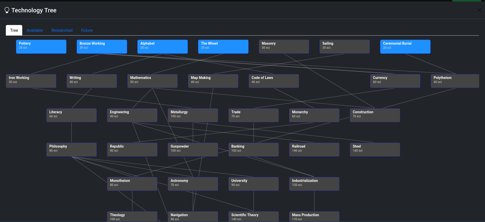
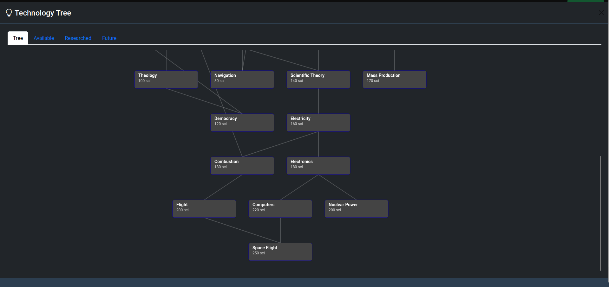

:toc:
:toclevels: 1
:sectnums:

= Civilization I Browser Game

**Overall Assessment** +
Zivilisation_1 is not a perfect clone, but it is not trying to be one. +
It is a spiritual successor that takes the core concepts of Civilisation and reimagines them for a modern audience. +
For players seeking a nostalgic Civilization-like experience in the browser, it delivers! +
For purists seeking a 1:1 recreation of the 1991 original, it falls short in several areas but therefor it introduces more stratgic depth, more strategie and a non-cheating AI. +
The implementation is technically impressive (TypeScript, React, Vite, comprehensive tests, data-driven design) and functionally complete (the game is winnable and playable). +
The developers should be commended for creating a sophisticated strategy game that honors its inspiration while making sensible modernizations. +

[.text-center]
--
image::doc/1.jpg[Screenshot 1, width=800]

image::doc/world_map.png[World Map, width=800]

image::doc/Bildschirmfoto_20260906_003420.png[Screenshot 1, width=800]
image::doc/Bildschirmfoto_20260906_003442.png[Screenshot 2, width=800]





image::doc/2_1.png[Screenshot 2, width=800]
image::doc/4.png[Screenshot 4, width=800]
image::doc/5.png[Screenshot 5, width=800]


image::doc/action_menu.png[Action Menu, width=800]

image::doc/end_turn.png[End Turn, width=800]

image::doc/all_over.png[All Over, width=800]

--


== Architecture

=== Project Structure

The project follows a modular architecture separating concerns:

```
src/
├── components/          # React UI components
│   ├── game/            # Canvas, unit stack, unit actions
│   └── ui/              # Panels, modals, dialogs
├── data/                # All balance data: terrains, units, buildings, techs
│   └── maps/            # Static Freeciv-derived map JSON + registry
├── game/
│   ├── engine/          # GameEngine, turn/phased systems, AI/
│   │   ├── AI/          # The computer-player layer, ~9k lines
│   │   └── MapGenerator/# Procedural world generation
│   └── rendering/       # Canvas map, minimap, terrain textures, animation
├── hooks/               # Custom React hooks
├── stores/              # Zustand state management
├── styles/              # CSS stylesheets
├── utils/               # Helpers, event handlers, logging, export
doc/                     # Subsystem documentation (see the index below)
e2e/                     # Playwright specs
scripts/                 # Headless AI session and batch runners
tests/                   # Vitest suites
```

The whole game is ~57,000 lines of TypeScript and TSX. `GameEngine.ts` (6,551
lines) is the world state and the public API; everything else is a subsystem it
owns.

== Implementation Status


[IMPORTANT]
====
link:doc/GAME_RULES.adoc[Game Rules Reference] is the authoritative source for
every balance number in this game — terrain yields, unit stats, costs, the
technology tree, and the economy, combat and research formulas. If this README
and that document ever disagree, the rules reference is right.

`GAMEPLAY.md` is a shorter, older player-facing summary. It is known to lag
behind the code in places.
====

=== Implemented

Gameplay::
* 14 playable civilizations with leaders, portraits and city-name lists
* City founding, joining, capture, destruction and razing
* City growth, starvation, granaries, disorder and martial law
* Tile yielding, worked-tile assignment, specialists (entertainer/taxman/scientist)
* City governors, manual tile assignment and citizen reassignment
* Units, unit stacking, sleep, fortify, skip, wait, GoTo orders
* Combat with terrain, fortification, city walls and siege units
* City assault and capture with walls loss, plunder and unrest
* Technology tree (45 techs) with map-size and difficulty cost scaling
* Governments, revolutions and anarchy
* Diplomacy: war, peace, ceasefires, alliances, treaties, bribes, diplomats
* Trade routes with caravans, intercontinental bonuses
* Naval warfare, ferry transport with cargo, Fisher Boats and fishing nets
* Barbarian hordes, including capturing cities
* Villages / goody huts with all five Civ I outcomes
* Tile improvements: irrigation, roads, railroads, mines, fortresses, pollution
* Fog of war, per-player visibility, scout memory
* Two victory conditions: Moonshot and elimination

Systems::
* Save/load to a versioned JSON blob in `localStorage`, with migration
* Full AI: 6 production profiles, strategy selection, research, government,
  diplomacy, army groups, naval doctrine, city governor, auto-production
* Headless AI batch/session runners and a progression CSV export
* 14 map types including 3 static maps and 4 unattended AI-vs-AI scenarios
* Animated movement, combat, camera glide and death
* Minimap, tech tree, statistics, demographics, settings, game menu
* Developer URL parameters for reproducible, unattended runs

=== In Development

* 🔄 Per-civ doctrines — design proposal in `doc/leader-doctrines.adoc`
* 🔄 AI governor rebuild — design proposal in `doc/space-bunny-free_ai_gov.adoc`

=== Known Gaps

These are documented but not implemented, and the documentation used to claim
otherwise:

* **No veteran units.** The badge and the data field exist; the combat formula
  has no veteran term.
* **No score-based win.** Only Moonshot and elimination end a game.
* **No housing cap.** An Aqueduct does not gate city size.
* **No sound.** There is no audio layer at all.

=== Planned Features

* 📋 Sound effects and music
* 📋 Multiplayer support (hot-seat)
* 📋 Per-civ gameplay advantages (doctrines)
* 📋 Combat animation beyond the current damage flash
* 📋 More static maps

=== Core Systems

**Game Engine** (`GameEngine.ts`, 6,551 lines)::
Owns the world state — grid, map, units, cities, civilizations, technologies,
per-player storage, ID allocators — and is the public API the UI talks to. It
emits everything through a single `onStateChange(eventType, data)` channel.

**Turn Manager** (`TurnManager.ts`)::
The phased turn engine. `START → UNIT_MOVEMENT → CITY_PRODUCTION → RESEARCH →
END`, the round boundary, unit reset, and the whole economic pipeline.

**Map System** (`SquareGrid.ts`, `engine/Pathfinding.ts`, `MapGenerator/`)::
An **8-way square grid** — not hexagonal. A* pathfinding with per-unit
passability, and a procedural generator (continents → temperature → climate →
age → rivers → polar caps → resources → build sites).

**Combat** (`engine/CombatSystem.ts`)::
The single source of truth for fighting. `winChance = A / (A + D)`, 25 damage to
the loser only, ×1.5 fortified, ×3 city walls, siege units ignore walls.

**City System** (`engine/EconomicManager.ts`, `engine/ProductionManager.ts`,
`AutoProduction.ts`)::
Yields, corruption, tax/science/luxury split, food, growth, happiness, upkeep,
bankruptcy, build queues and tech gating. Auto-production is shared between the
human (opt-in per city) and the AI.

**Research** (`engine/ResearchManager.ts`)::
Beaker scaling by map size, difficulty, tech count, known civs and prereqs.

**Diplomacy** (`engine/DiplomacyManager.ts`)::
Pairwise relations, reputation, attitude, willingness, treaties, bribes, and the
AI's own diplomatic decisions.

**Victory** (`engine/VictoryManager.ts`)::
Moonshot and elimination detection, plus the live Civ I score.

**AI** (`engine/AI/`, ~9,000 lines)::
See link:doc/AI_OVERVIEW.md[AI Overview] for the map, and
`AIManager.ts` for the turn orchestrator.

**Fog of War** (`GameEngine.playerStorage`)::
Per-player visibility and explored arrays, sight propagation, and scout memory
that survives across turns.

**Persistence** (`GameEngine.getSaveJSON` / `loadGame`)::
A versioned JSON blob including per-civ fog, AI state, diplomacy, GoTo paths and
scout discoveries. Load migrates v1 and v2 saves.

**Rendering** (`rendering/MapRenderer.ts` + friends)::
A cached static terrain layer, a dynamic unit/city layer, an offscreen minimap,
and composable tile textures. See link:doc/RENDERING_ASSETS.md[Rendering & Tile Assets].

=== State Management

**Zustand Store** (`GameStore.ts`)::
The single global store. It holds a *mirror* of the engine state for React to
render, plus all UI state (selection, modals, camera, settings). The engine
pushes into it; the engine is the source of truth for game rules.

**React Integration**::
* `useGameEngine` wires React to the engine instance
* `EngineEventHandlers.ts` translates engine events into store updates
* Zustand is the only state container — there is no React Context in this project

=== Data Architecture

**Balance data** (`src/data/`)::
* `TerrainConstants.ts` - terrain yields, defence, movement, resources, spawn chances
* `UnitConstants.ts` - unit stats, costs, tech requirements, cargo capacity
* `BuildingConstants.ts` - 23 buildings and 10 wonders
* `TechnologyData.ts` - the 45-technolog tree
* `GovernmentData.ts` - tax caps, tolerance, corruption, happiness
* `TileImprovementConstants.ts` - improvements and worker-turns per terrain
* `VillageConstants.ts` - goody hut outcomes and the AI's risk model
* `GameConstants.ts` - global constants, map types, specialist yields, colours

All of it is transcribed in link:doc/GAME_RULES.adoc[Game Rules Reference].

**Legacy note**:: There is a second, partly divergent set of definitions in
`src/game/Terrain.ts`, `src/game/City.ts` and `src/game/Unit.ts`, plus a re-export
table in `src/utils/Constants.ts` and two further technology tables. The
runtime engine uses the `src/data/*` tables. The legacy classes are excluded
from `knip` analysis. Do not add new rules there.

**Type Definitions** (`types/game.ts`)::
Comprehensive TypeScript interfaces for type safety across the application.

== Tech Stack

=== Frontend Framework
* **React 18**: Modern React with hooks, functional components, and concurrent features
* **TypeScript**: Full type safety and enhanced developer experience
* **Vite**: Lightning-fast development server and optimized production builds

=== State Management
* **Zustand**: The only global state container. There is no React Context in this project.

=== UI Framework
* **Bootstrap 5**: Responsive design system and component library
* **React Bootstrap**: React integration for Bootstrap components
* **Bootstrap Icons**: Consistent iconography throughout the interface
* **canvas-confetti**: Victory effect

=== Rendering and Graphics
* **HTML5 Canvas**: Hardware-accelerated 2D graphics rendering
* **Canvas API**: Custom drawing routines for maps, units, and UI elements
* A cached static terrain layer plus a dynamic unit/city layer, so a 180×90 map
  does not redraw 16,000 tiles every frame

=== Development Tools
* **ESLint** + `typescript-eslint`, `react-hooks`, `react-refresh`: linting
* **Vitest**: ~75 unit and integration test suites
* **Playwright**: end-to-end specs, including a headless AI-vs-AI run
* **knip**: dead-export and unused-dependency detection
* **TypeScript Compiler**: type checking
* **Qodana** (`qodana.yaml`): JetBrains static analysis config

NOTE: There is no Prettier in this project. Formatting is not enforced by a
formatter — match the surrounding style.

=== Build and Deployment
* **Vite**: Fast development server and optimized production builds
* **npm**: Package management and script execution
* **Git**: Version control and collaboration

== Game Overview

Civilization I is a turn-based strategy game where players guide a civilization from the ancient era to the space age. Compete against AI-controlled civilizations led by historical figures, manage cities, research technologies, and win by researching Moonshot or by eliminating every rival.

=== Historical Civilizations

Choose from 14 authentic civilizations, each with unique leaders and city names:

* **Americans** (Abraham Lincoln) - Blue from the stars and stripes
* **Aztecs** (Montezuma) - Jungle-inspired teal
* **Babylonians** (Hammurabi) - Pottery brown/orange
* **Chinese** (Mao Tse Tung) - Imperial yellow
* **Egyptians** (Ramesses II) - Nile valley gold
* **English** (Elizabeth I) - Royal red
* **French** (Napoleon Bonaparte) - White for defete
* **Germans** (Frederick the Great) - Gray from the iron cross
* **Greeks** (Alexander the Great) - Mediterranean blue
* **Indians** (Mahatma Gandhi) - Saffron and green
* **Huns** (Dschingis Khan) - Steppe turquoise
* **Romans** (Julius Caesar) - Black since all other colors were taken
* **Russians** (Joseph Stalin) - Soviet red
* **Zulus** (Shaka) - African tribal colors

Choosing a civilization currently changes only your color, leader portrait and
city-name list. There is no per-civ gameplay advantage yet — see
link:doc/leader-doctrines.adoc[Leader Doctrines] for the design proposal.

=== Victory Conditions

There are exactly **two**, checked at the end of every turn.

**Moonshot Victory**::
Research `Moonshot` (Space Flight → Moonshot) and you win immediately, alongside
anyone else who gets there first. It is the only space-race content in the game.

**Elimination Victory**::
Be the last civilization still *operational* — owning at least one unit or one
city. A rival with a single surviving unit keeps the game running.

You lose when your civilization is eliminated, or when an AI wins while you are
still alive.

[NOTE]
====
There is deliberately **no** "capture every city" shortcut and **no** score-based
win at 2100 AD. If you see a claim to the contrary elsewhere in this repository,
it is out of date.

The Civ I *score* is still calculated every turn and shown on the scoreboard and
in the exported CSV — it just does not end the game.
====

See link:doc/GAME_RULES.adoc[Game Rules Reference] for the exact score formula.

== Core Game Concepts

NOTE: The numbers in this section are a summary. The authoritative tables —
terrain yields, unit stats, costs, technology tree, formulas — are in
link:doc/GAME_RULES.adoc[Game Rules Reference].

== Core Game Concepts

=== Game Structure

**Rounds and Turns**::
* *Round*: Completed when all active civilizations finish their turns. Year advances at round end.
* *Turn*: Each civilization's opportunity for actions. Phases: START → UNIT_MOVEMENT → CITY_PRODUCTION → RESEARCH → END.
* *Moves*: Units have movement points per turn, cannot exceed limits.

**Time Progression**::
Game spans 4000 BC to 2100 AD with era-dependent year increments:

[cols="1,1", options="header"]
|===
|Era |Years per Round

|Before 1000 AD
|+20 years

|1000–1499 AD
|+10 years

|1500–1749 AD
|+5 years

|1750–1849 AD
|+2 years

|1850+ AD
|+1 year
|===

NOTE: Year 0 is skipped (1 BC → 1 AD).

=== Resource Management

**Food**::
Enables city growth and population increase. Surplus accumulates for expansion.

**Production (Shields)**::
Builds units, buildings, and wonders. Cities produce one item at a time.

**Trade (Commerce)**::
Generates gold for purchasing units and buildings. Enhanced by marketplaces and banks.

**Science**::
Advances technology research. Boosted by libraries and universities.

**Gold**::
Maintains units, purchases improvements. Generated from trade and taxation.

=== City Management

**Founding Cities**::
* Use a Settler on suitable terrain
* Placement determines which 20 tiles you can ever work
* AI cities keep a 5-tile minimum gap. **You may found adjacent cities.**

**City Growth**::
* Accumulate food surplus; the threshold is `(population + 1) × 10`
* Each citizen eats 2 food; each of your settlers eats 1 (2 under Republic/Democracy)
* A Granary keeps half the food box on growth; without one the box empties
* There is no housing cap — an Aqueduct does not gate city size

**Production System**::
* Cities build one unit, building or wonder at a time
* Shields come from worked tiles, minus the settler shield tax under Republic/Democracy
* A Settler completing in a size-1 city destroys that city

**Happiness Management**::
* Unhappy citizens above your government's tolerance cause disorder
* A disordered city produces no tax, science, luxury or commerce
* Temples, Colosseums, Cathedrals, Mass Transit, Hanging Gardens, Women's
  Suffrage improve happiness
* Martial law suppresses unrest: 4 in Despotism, 3 in Monarchy and Communism,
  0 in Republic and Democracy
* Entertainers generate 2 luxury each

=== Technology Research

**Research System**::
* Pick one technology at a time
* Cost scales with map size (bigger map is harder), difficulty (harder is
  easier), how far ahead you are, how many civs you know, and how many
  prereqs are missing
* Locked for the first 5 rounds
* Science produced with nothing selected banks and is spent on the next pick

**Technology Tree**::
45 technologies, 8 of them available from the start. See
link:doc/GAME_RULES.adoc[Game Rules Reference] for the full tree with costs and
prerequisites, and link:doc/TECHNOLOGY_RESEARCH.md[Technology Research] for the
beaker math.

=== Military System

33 unit types: 15 land military, 11 ships, 4 civilian, 3 air. Every unit has
2 hit points. Full stat tables in link:doc/GAME_RULES.adoc[Game Rules Reference].

**Combat Mechanics**:
* `winChance = attackerStrength / (attackerStrength + defenderStrength)`
* Attacker strength = `attack × health/100`
* Defender strength = `defense × health/100 × terrain × (1.5 if fortified or in a city) × (2 with a Fortress)`
* Terrain: forest/river/lake/swamp/jungle ×1.5, hills ×2, mountains ×3
* Only the loser takes damage — 25 HP, or death if the round was decisive
* City walls give the city `max(1, population) × 3`
* Catapult, Cannon, Artillery and all air units ignore city walls
* Attacking auto-declares war, and cascades to the defender's allies
* **There are no veteran units** — the badge exists, the bonus does not

=== Terrain and Improvements

13 terrains. Summary of the common ones:

[cols="2,1,1,1,1,1", options="header"]
|===
|Terrain |Move |Def |Food |Prod |Trade

|Grassland
|1
|1
|2
|1
|0

|Plains
|1
|1
|1
|1
|0

|Forest
|2
|1.5
|1
|2
|0

|Hills
|2
|2
|1
|0
|0

|Mountains
|3
|3
|0
|1
|0

|Ocean
|1
|1
|1
|0
|2
|===

Plus tundra, desert, jungle, swamp, arctic, river and lake. Full table in
link:doc/GAME_RULES.adoc[Game Rules Reference].

**Tile Improvements**:

* **Irrigation** — +1 food; converts forest, jungle and swamp. Needs adjacent fresh water. 5 worker-turns on open ground, 15 in forest/jungle/swamp.
* **Road** — movement cost × 1/3, and +1 trade on grassland, plains and desert only.
* **Railroad** — movement cost 0.05, +0.5 to all three yields. Needs the Railroad technology and an existing road.
* **Mines** — +3 production on hills, +1 on mountains. Converts grassland and plains to forest.
* **Fortress** — defence ×2. Needs Construction.
* **Pollution** — −1 to everything. Cleared by a unit for 2 movement points.

Worker-turns vary by terrain; the full matrix is in the rules reference.

=== Government Types

[cols="2,1,1,1,1,2", options="header"]
|===
|Government |Max tax |Tolerance |Corruption |Happiness |Notes

|Despotism
|100
|2
|0.30
|0
|Your starting government. Martial law 4.

|Monarchy (Monarchy tech)
|100
|3
|0.25
|+1
|Martial law 3.

|Republic (Republic tech)
|100
|4
|0.15
|+2
|Settlers cost 1 shield each. Martial law 0.

|Democracy (Democracy tech)
|10
|5
|0.05
|+4
|Settlers cost 1 shield each. Martial law 0.

|Communism (Communism tech)
|100
|3
|0.10
|+1
|−25 % commerce. Martial law 3.
|===

A revolution passes through **Anarchy**, which lasts 3 turns and forces all
your rates to 0. The AI only revolts when a candidate beats the current
government by a clear margin.

=== Diplomacy

**Diplomatic Actions**:
* Declare War
* Negotiate Peace
* Sign Alliance
* Sign, cancel and query Treaties (trade, open borders, mutual defence, non-aggression, embargo, technology exchange)
* Demand Tribute
* Offer and counter-offer
* Bribe a unit out of another civilization
* Exchange maps (via a Diplomat unit)

**Diplomatic States**:
* **Peace** - No hostilities
* **War** - Active conflict; cascades to the defender's allies
* **Alliance** - Military cooperation
* **Ceasefire** - Temporary peace; breaking one costs 30 reputation

Attitude runs on a score built from the AI civ's `diplomacy` and `aggression`
personality, the current status, active treaties, the military strength ratio and
border friction. Reputation penalties: peace broken −30, alliance broken −50,
surprise attack −20, recovering 1 per turn.

Full detail in link:doc/DIPLOMACY_SYSTEM.md[Diplomacy System] and
link:doc/save-load-system.adoc[Save & Load System] (diplomacy report and leader
portraits).

=== Wonders of the World

10 wonders, all cost 0 upkeep. The complete list with costs and technology
requirements is in link:doc/GAME_RULES.adoc[Game Rules Reference].

[cols="2,1,2", options="header"]
|===
|Wonder |Cost |Requires

|Lighthouse
|200
|Map Making

|Great Wall
|300
|Masonry

|Hanging Gardens
|300
|Ceremonial Burial

|Oracle
|300
|Philosophy

|Pyramids
|300
|Masonry

|Magallan's Voyage
|400
|Navigation

|Michelangelo's Chapel
|400
|Monotheism

|Newton's University
|400
|University

|United Nations
|600
|Democracy

|Women's Suffrage
|600
|Democracy
|===

[NOTE]
====
There is no Apollo Program, no Colossus, no Great Library, no Observatory and no
Research Lab in this codebase, despite what older documents said. A wonder's
*effects* are declared in the data but only some are read by the engine — treat
the effect column in the rules reference as intent, not as guaranteed behaviour.
====

=== Barbarians

**Barbarian Mechanics**:
* A phantom horde that acts once per round, before anyone else
* Spawned by **Barbarian Ambush** villages, and by captured cities
* They become a real, targetable civilization the moment they hold a city
* Assault a city when they have at least 2 units and 1.5× its estimated defence
* A captured barbarian city has its buildings sold and pumps out raiders
* They are always hostile and have no diplomacy

They cannot be a loss condition until they hold a city. See
link:doc/GAME_RULES.adoc[Game Rules Reference] § Barbarians.

== Features

=== Core Gameplay Features

* **Turn-based Strategy**: Classic Civilization mechanics with modern React architecture
* **8-way Square Grid**: 8-direction movement on a square grid, with A* pathfinding
* **AI Civilizations**: 2–7 computer opponents with 6 production profiles, strategy re-evaluation, army groups, a city governor, naval doctrine and their own diplomacy
* **City Management**: Founding, joining, capture, governors, specialists, manual tile assignment
* **Unit System**: 33 units across land, sea, air and civilian, with sleep, fortify, skip, wait and GoTo
* **Technology Research**: 45 technologies with map-size and difficulty cost scaling
* **Resource Management**: Balance food, production, trade, science and gold across your empire
* **Government Systems**: Six governments including Anarchy, each with its own corruption, tolerance and rate limits
* **Diplomacy System**: War, peace, ceasefires, alliances, five treaty types, bribes, counter-offers
* **Naval Warfare**: 11 ships, ferries with 3-unit cargo, Fisher Boats, island detection
* **Trade Routes**: Caravans, intercontinental bonuses, up to 3 routes
* **Fog of War**: Per-player visibility, explored memory, and cross-turn scout intelligence
* **Wonder Construction**: 10 world wonders
* **Barbarians**: A separate horde AI that can capture cities

=== User Interface Features

* **Interactive Map**: Canvas-based rendering with zoom, pan, and terrain examination
* **Minimap**: World overview with navigation and territory display
* **Context Menus**: Right-click menus for unit orders and terrain improvements
* **Modal Dialogs**: City, unit stack, technology tree, statistics, demographics, diplomacy and settings
* **Auto End Turn**: Opt-in, and it will not steal your turn while a city still needs a build order
* **Game Result Overlay**: Victory/defeat announcements with a final score
* **Full Keyboard Control**: Units, cities, rates, government, camera and dialogs

=== Technical Features

* **Two-Layer Canvas Rendering**: a cached static terrain layer and a dynamic unit/city layer, so a 180×90 map stays responsive
* **Composable Tile Textures**: base terrain + feature artwork, pre-rendered offline
* **Unit Icon System**: SVG with PNG and emoji fallbacks, transparent so the terrain shows through
* **Reproducible Games**: a pinned `?seed=` fixes the map, the start assignment and the AI profile rotation
* **Unattended Play**: `?maptype=AI_VS_AI_NAVAL&seed=123&noanim` plays a whole naval game with no clicks
* **Headless AI Harness**: batch runners and a progression CSV for regression analysis
* **Save/Load**: versioned JSON with v1 and v2 migration
* **Error Boundaries**: React error handling for robust user experience
* **Type Safety**: Full TypeScript implementation

== Installation

=== Prerequisites

* Node.js 18 or higher
* npm or yarn package manager
* Modern web browser with HTML5 Canvas support

=== Setup Instructions

1. **Clone the repository**:
We are using Git LFS for large assets, +
 so ensure you have it installed.
Ubuntu/Debian:
```bash
sudo apt install git-lfs
```
Fedora:
```bash
sudo dnf install git-lfs
```
Windows:
```powershell
winget install -e --id GitHub.GitLFS
```
OR download and install from
https://git-lfs.com/

**Clone Repository**:
[source,bash]
----
git clone https://github.com/JCTRoth/Civ1Browser.git
git lfs pull
cd Civ1Browser
----

2. **Install dependencies**:
+
[source,bash]
----
npm install
npx playwright install chromium
----

3. **Start development server**:
+
[source,bash]
----
npm run dev
----

4. **Open in browser**:
+
Navigate to `http://localhost:3000`

=== Production Build

[source,bash]
----
npm run build
npm run preview
----

== Usage

=== Game Setup

1. **Select Difficulty**: Choose from Chieftain to Emperor levels
2. **Choose Civilization**: Pick from 14 historical civilizations
3. **Configure Opponents**: Select number and types of AI civilizations
4. **Set World Size**: Choose map dimensions and terrain settings
5. **Start Game**: Begin your civilization's journey

=== Controls

==== Keyboard Shortcuts — unit and city

* **Arrow keys**: move the selected unit (or, with no selection, pan the map)
* **Shift + arrows**: pan the camera
* **Space**: cycle through the units stacked on the selected tile
* **Enter**: end turn
* **S**: skip the selected unit
* **W**: wait (the unit stays put but keeps its moves)
* **F**: fortify
* **G**: GoTo — click a destination and the unit walks there over several turns
* **B**: build a road
* **I**: build irrigation
* **M**: build mines
* **P**: clean pollution
* **R**: rush production in the selected city
* **C**: centre the camera on the selected unit
* **T**: tax / science / luxury rate sliders
* **G** (with a city selected): government and revolution dialog
* **D** or **F4**: diplomatic relations
* **Esc**: cancel the pending action, close a dialog, or clear the selection

==== Keyboard Shortcuts — view and system

* **+** / **-**: zoom in and out
* **Ctrl + 1 … 9**: select the 1st to 9th city
* **Ctrl + S**: save
* **Ctrl + L**: load
* **Ctrl + P**: pause / resume
* **F1**: help
* **F2**: technology tree
* **F3**: settings
* **F11**: fullscreen

==== Mouse Controls

* **Left Click**: Select units, cities, or terrain
* **Right Click**: Open context menu for actions
* **Scroll Wheel**: Zoom in/out
* **Click + Drag**: Pan map view

=== Unattended and reproducible games

Every one of these is a URL parameter. See
link:doc/GAME_RULES.adoc[Game Rules Reference] § Developer URL parameters for the
full list.

[source]
----
# a whole naval spectator game, no clicking, fully deterministic
http://localhost:5173/?maptype=AI_VS_AI_NAVAL&civs=7&seed=123&gold=50&noanim

# straight into a normal 2-civ skirmish
http://localhost:5173/?quickstart

# a small battlefield with units already posed for combat
http://localhost:5173/?combatlab
----

Pinning `seed` fixes the map, the starting positions, which AI gets which
production profile, and the profile rotation — so a bug reproduces exactly.

=== Basic Gameplay

1. **Explore**: Move units to reveal the map and find resources
2. **Settle**: Use Settlers to found cities on good terrain
3. **Research**: Choose technologies to unlock new capabilities
4. **Build**: Construct buildings and units in your cities
5. **Expand**: Grow your territory and influence
6. **Conquer**: Engage in warfare when necessary
7. **Diplomacy**: Negotiate with other civilizations
8. **Victory**: Achieve one of the victory conditions

== Development

=== Available Scripts

* `npm run dev` - Start development server
* `npm run build` - Create production build
* `npm run preview` - Preview production build
* `npm run lint` - Run ESLint
* `npm run type-check` - Run TypeScript compiler check
* `npm run test` - Run the Vitest suite
* `npm run test:e2e` - Run the Playwright suite
* `npm run knip` - Find unused exports and dependencies

=== Development Guidelines

**Code Style**:
* Use TypeScript for all new code
* Follow React functional component patterns
* Use custom hooks for complex logic
* Maintain separation between UI and game logic
* No Prettier — match the surrounding style by hand

**Where to put a rule**:
* Balance data goes in `src/data/*`. Never in the engine.
* Engine mechanics go in the matching `src/game/engine/*` file. `GameEngine.ts`
  is already 6,551 lines — do not grow it; find or make a subsystem.
* Anything the AI also needs belongs in shared engine code, not in `AI/`.

**State Management**:
* The engine owns game state. Zustand is a *mirror* for React to render.
* Emit through `onStateChange`; let `EngineEventHandlers` update the store.

**Performance**:
* Keep the static terrain layer cached — see `RENDERING_ASSETS.md`
* Use React.memo for expensive components
* Implement proper key props for list rendering

**Balance changes**:
* Change the number in `src/data/*`
* Update link:doc/GAME_RULES.adoc[Game Rules Reference] in the same commit
* Say in the commit message which rule the number encodes

=== Architecture Decisions

**8-way Square Grid**::
The grid is a square grid with 8-direction movement, not hexagonal.
`SquareGrid.ts` and `Pathfinding.ts`. The original hex plan was not implemented.

**Engine owns state, Zustand mirrors it**::
`GameEngine` is the source of truth. The Zustand store holds a copy for React and
all UI state. The engine talks to the UI through one `onStateChange` callback.
This keeps game rules testable in Vitest without a DOM.

**One combat implementation**::
`CombatSystem.ts` is the only place a battle is resolved. `GameEngine` calls into
it rather than re-deriving a formula. Keep it that way.

**Shared auto-production**::
The AI has no production code of its own. It uses the same `AutoProduction` you
can enable per city, so AI and human cities follow identical rules.

**Two canvas layers**::
A cached static terrain layer and a dynamic unit/city layer. See
link:doc/RENDERING_ASSETS.md[Rendering & Tile Assets].

**Zustand over Redux**::
Lighter weight, less boilerplate, better TypeScript integration for this project scope.

**Bootstrap Integration**::
Provides consistent, responsive UI without custom CSS framework development.

=== Documentation

link:doc/GAME_RULES.adoc[Game Rules Reference] is the authoritative source for
every balance number. Start there before changing anything.

==== Core rules

* link:doc/GAME_RULES.adoc[Game Rules Reference] -- turn cycle, terrains, units, buildings, wonders, the 45-tech tree, governments, and every formula
* link:doc/TERRAIN_AROUND_CITY.md[Terrain Around City] -- work radius, tile yields, worker assignment
* link:doc/TECHNOLOGY_RESEARCH.md[Technology Research] -- the beaker cost model
* link:doc/GOVERNMENT.md[Government & Revolution] -- revolutions, anarchy, capital
* link:doc/DIPLOMACY_SYSTEM.md[Diplomacy System] -- relations, treaties, reputation, diplomat actions
* link:doc/CITY_CAPTURE.md[City Capture & Destruction] -- what happens when a city falls
* link:doc/auto-end-turn.adoc[Auto. turn ending] -- the opt-in auto end of turn

==== Systems

* link:doc/FOG_OF_WAR_IMPLEMENTATION.md[Fog of War] -- per-player visibility and storage
* link:doc/GOTO_MANAGER_IMPLEMENTATION.md[GoTo Manager] -- pathfinding orders and path persistence
* link:doc/GAME_PROGRESSION_EXPORT.md[Game Progression Export] -- the analysis CSV format
* link:doc/save-load-system.adoc[Save & Load System] -- the save format, and the diplomacy report with leader portraits

==== AI

* link:doc/AI_OVERVIEW.md[AI Overview] -- **start here**: the map of the AI layer
* link:doc/AI_ECONOMY.md[AI Economy] -- tax policy, the gold reserve, bankruptcy
* link:doc/AI_PRODUCTION.md[AI Production] -- profiles and expansion-first production
* link:doc/AI_SETTLER_INTEGRATION.md[AI Settler Integration] -- site selection
* link:doc/AI_VS_AI_ANALYSIS.md[AI vs AI Analysis] -- a 300-round headless analysis
* link:doc/AI_MICRO_ERRORS_REPORT.adoc[AI Micro-Errors Report] -- a 587-round micro-error catalogue
* link:doc/SCOUT_AND_ENEMY_SEARCH.md[Scout & Enemy Search] -- the scout unit and spiral search

==== Maps and rendering

* link:doc/STATIC_MAPS.md[Static Maps] -- the static map format and registry
* link:doc/NEW_MAP_GUIDE.adoc[Adding a New Map] -- step by step, with a checklist
* link:doc/RENDERING_ASSETS.md[Rendering & Tile Assets] -- layers, feature images, the tile generator, zoom

==== Design proposals

Not implemented. Read these before proposing more AI work.

* link:doc/space-bunny-free_ai_gov.adoc[AI Governor Architecture] -- critique of the current AI shape and a proposed rebuild
* link:doc/leader-doctrines.adoc[Leader Doctrines] -- per-civ identities hung on diplomacy

=== Testing Strategy

* **Unit and integration tests** (`tests/`, ~75 Vitest suites): cover the engine
  directly, with no DOM. This is where game rules are tested — combat, economy,
  turn order, research, diplomacy, AI, save/load, map generation.
* **End-to-end tests** (`e2e/`, Playwright): `game.spec.ts` for a full turn,
  `combat.spec.ts` for the combat lab, `ai-vs-ai.spec.ts` for a headless
  unattended run.
* **Headless AI regression**: `scripts/run-ai-batch.mjs` runs many seeds and
  exports a progression CSV, which is how AI changes are judged.

Before you push:

[source,bash]
----
npm run lint
npm run type-check
npm run test
npm run knip
----

=== Contributing

1. Fork the repository
2. Create a feature branch
3. Make changes with tests
4. Ensure `npm run lint`, `npm run type-check` and `npm run test` pass
5. If you touched a balance number, update `doc/GAME_RULES.adoc`
6. Submit pull request

Or just write me an E-Mail and we talk: info@mailbase.info

== Scoring System

Civilization score, recomputed every turn end:

* **Population**: 1 point per citizen
* **Land Area**: 1 point per unique workable tile in your cities' radii
* **Cities**: 1 point each, plus 5 more
* **Technologies**: 5 points per researched technology
* **Wonders**: 20 points per constructed wonder
* **Peace**: 1 point per 5 consecutive rounds at peace, reset by a war
* **Pollution**: penalty, from your own buildings

There is no Future Tech term. The score is a scoreboard, not a win condition --
see <<Victory Conditions>>.

== Strategy Guide

=== Early Game (4000-1000 BC)

1. Settle immediately. A settler costs 0 upkeep but eats food and, under
   Republic or Democracy, 1 shield a turn.
2. Found on a **river** if you can — the city centre gets 2/1/1 plus a river
   trade bonus, and a 1-wide river stays fordable.
3. Put the first few turns into irrigation or a road. Both are cheap and the
   payoff compounds.
4. Research Pottery for a Granary, or Bronze Working for a Phalanx.
5. Keep gold above zero. A negative treasury disbands your army.

=== Mid Game (1000 BC - 1000 AD)

1. Libraries in every city — +1 science and +1 culture each.
2. Currency → Trade → Banking is the economic line, and Trade unlocks Caravans
   for trade routes, which pay **both** gold and science.
3. Courthouses halve corruption, which matters as soon as your cities are far
   from the capital.
4. Monarchy, then Republic. Republic cuts corruption hard but starts taxing your
   settlers a shield each — do not switch while you are still expanding.
5. Oracle, Pyramids and Great Wall are all Masonry/Ceremonial Burial era and
   cost 300.

=== Late Game (1000-2100 AD)

1. The settler shield tax makes Democracy bad for a wide empire. Prefer
   Monarchy or Communism, and keep your cities compact.
2. Factories (+2 production) and Power Plants, but watch pollution — a polluted
   tile loses 1 of everything and needs a unit to clean.
3. **To win by technology**: Combustion → Flight → Computers → Space Flight →
   Moonshot. Moonshot is an instant win, and so is an AI reaching it first.
4. Or eliminate everyone. Remember a single surviving enemy unit keeps the
   game alive.

=== City Placement Strategy

* **Rivers**: the city centre gets +1 trade, and irrigation can reach the river
* **Coast**: needed for any ship, or a Fisher Boat with a Harbor
* **Fresh water beside you**: irrigation requires an adjacent river or lake
* **Resources**: +4 trade on Gems and Gold, +4 production on Oil, +3 food on an
  Oasis
* **Defence**: mountains ×3, hills ×2, a Fortress ×2 on top
* **Spacing**: you may build adjacent, but overlapping radii means you compete
  for the same tiles

=== Technology Priorities

**Moonshot (the only tech win)**::
The Wheel → Mathematics → Philosophy → Astronomy → Navigation → Banking →
Industrialization → Science Theory → Electricity → Combustion → Flight →
Computers → Space Flight → Moonshot

**Conquest**::
Bronze Working → Mathematics → Metallurgy → Gunpowder, then Iron Working →
Metallurgy → Steel for Battleships and the Cannon

**Expansion**::
Pottery → Writing → Literacy → Philosophy → Monotheism → Theology → Democracy,
with Currency → Trade → Trade Routes alongside

**Naval**::
Sailing → Map Making → Navigation, and Masonry early for the Harbor

== Deployment

This is a static single-page application (SPA) built with Vite. After building, deploy the `dist/` folder contents to any static web host.

Note that the game stores saves in `localStorage`, so a save is bound to the
browser profile that made it. The diplomacy report exports to a file instead.

=== Building for Production

[source,bash]
----
npm install
npm run build
----

The production build will be in the `dist/` directory.
