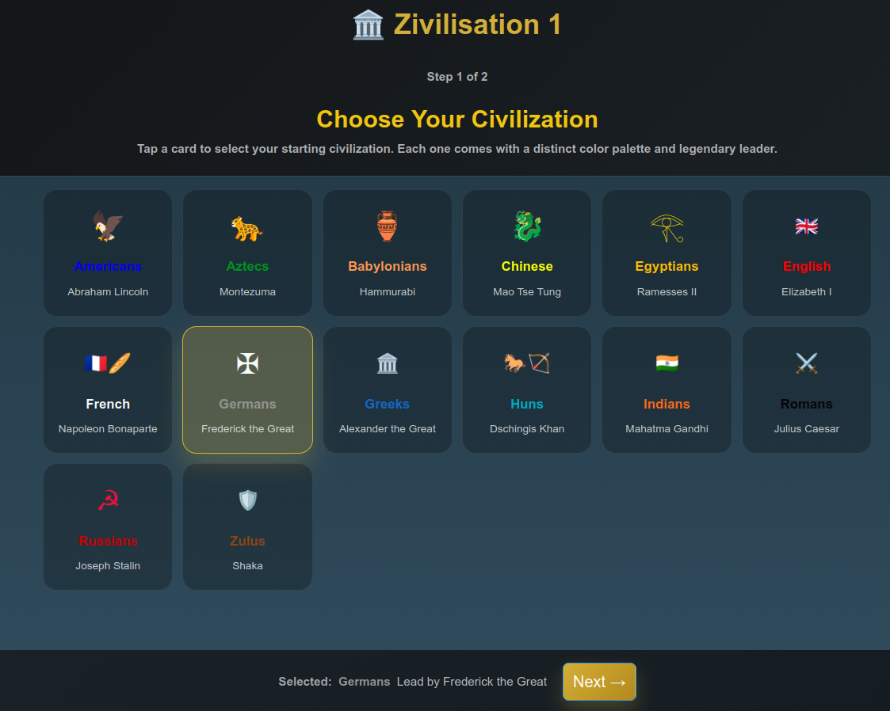
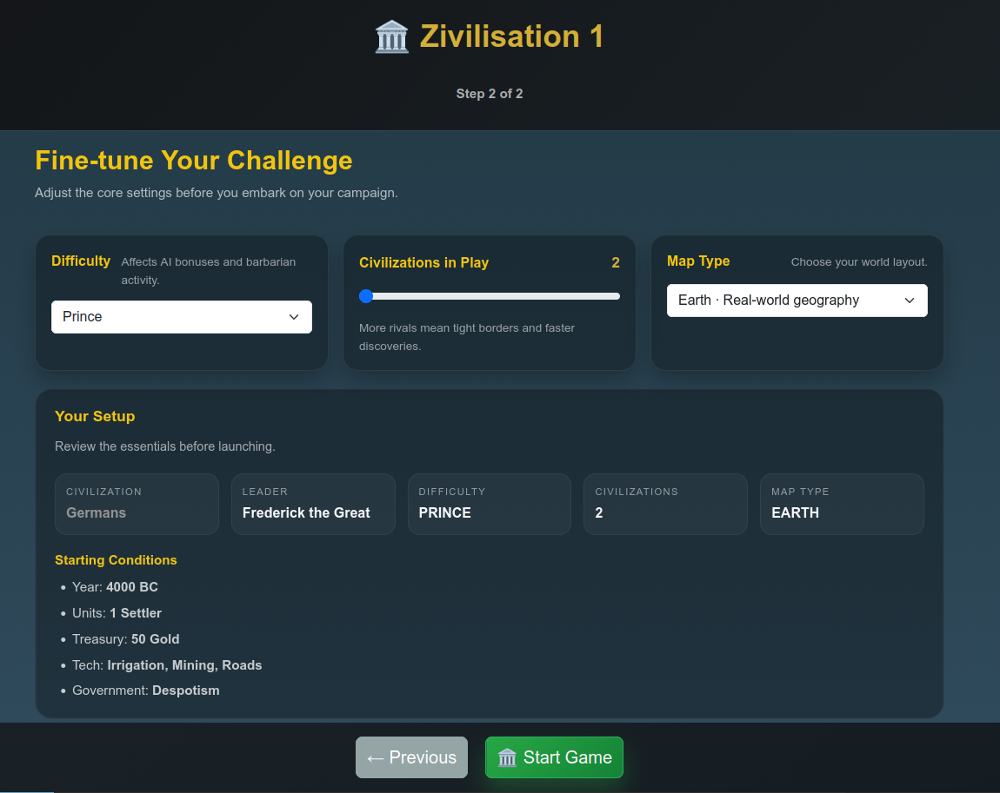
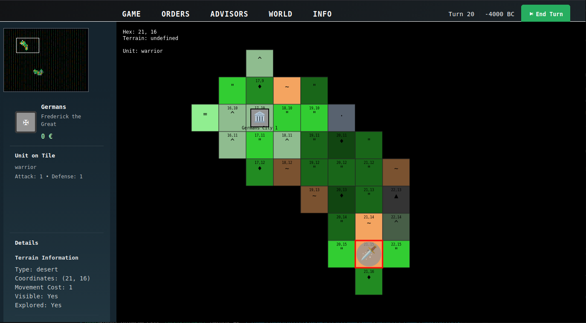
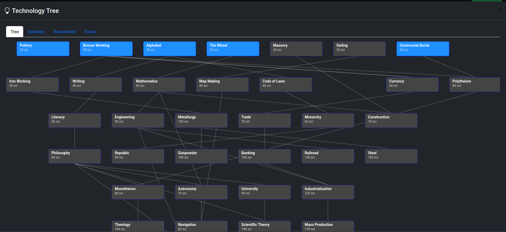
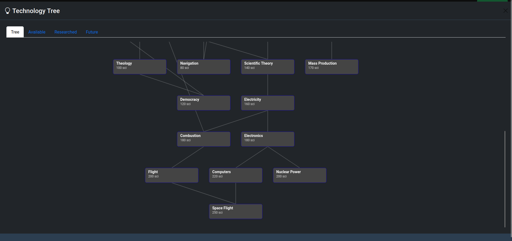

# Zivilization 1 Browser Game

A modern browser-based recreation of the first Civilization game (1991), built with: \
ReactJs, Vite, Zustand, and Bootstrap.









## Features

- **Turn-based Strategy Gameplay**: Classic Civilization mechanics with modern React architecture
- **Hexagonal Grid System**: Accurate hex-based world map with smooth navigation
- **AI Civilizations**: Compete against computer opponents with distinct personalities
- **City Management**: Build cities, manage population, construct buildings
- **Unit System**: Move armies, explore the world, engage in tactical combat
- **Technology Research**: Progress through technological advances
- **Resource Management**: Balance food, production, trade, science, and gold
- **Responsive UI**: Bootstrap-powered interface that works on desktop and mobile

## Tech Stack

- **React 18**: Modern React with hooks and functional components
- **Vite**: Lightning-fast development and building
- **Zustand**: Atomic state management for scalable React apps
- **Bootstrap 5**: Professional UI components and responsive design
- **HTML5 Canvas**: Hardware-accelerated game rendering
- **ES6 Modules**: Clean, modern JavaScript architecture

## Getting Started

### Prerequisites

- Node.js 18+ 
- npm or yarn package manager

### Installation

1. Clone the repository:
   ```bash
   git clone <repository-url>
   cd Civ1Browser
   ```

2. Install dependencies:
   ```bash
   npm install
   ```

3. Start the development server:
   ```bash
   npm run dev
   ```

4. Open your browser and navigate to `http://localhost:3000`

### Building for Production

```bash
npm run build
```
